# AREP-TallerAplicacionSegura

## Verbo Julian Camacho Villamarin
# bitacora
Construir una aplicación web segura usando certificados digitales
### Pasos
    • Crear una aplicación web no segura
    • Crear un par de llaves y generar los certificados
    • Modificar la aplicación para que use los certificados
    • Explicar la esencia del la Arquitectura (Metáfora del sistema)
### Arquitectura de ejemplo 
   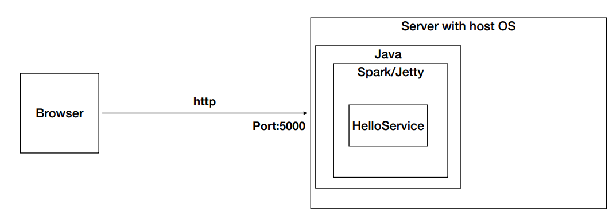
#### Creacion aplicacion web NO segura
   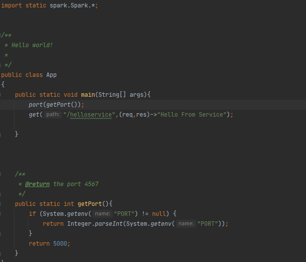

#### Arquitectura de ejemplo
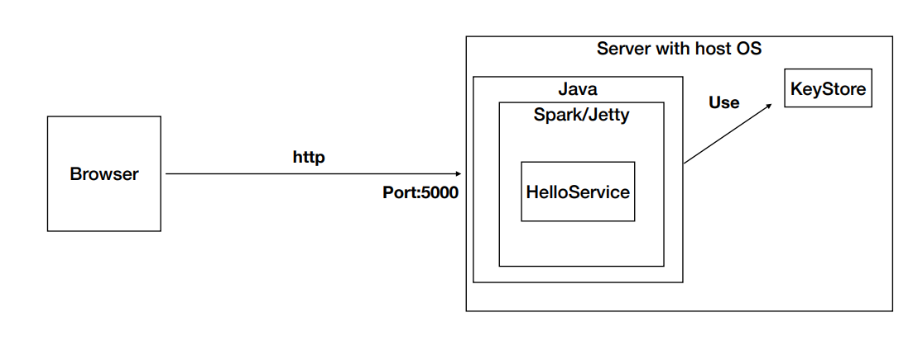
#### Crear llaves y certificado
    • Genere un par de llaves públicas y privadas y un certificado. Almacene todo en un archivo protegido.
    • Use el formato PKCS12 y no el JKS. La diferencia es que PKCS12 es un formato estándar para
    almacenar llaves y certificados, mientras que JKS es específico de Java.
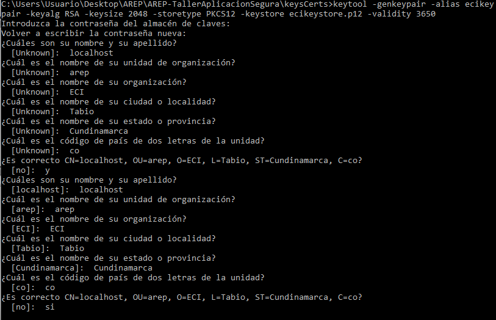

#### Modificamos los permisos a solo lectura

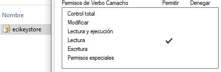

### Arquitectura de ejemplo
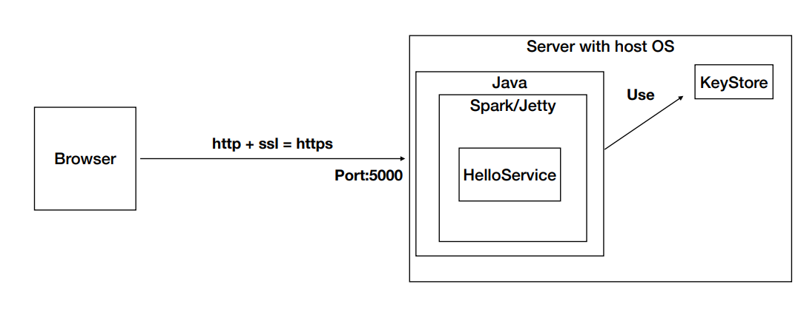

#### Implementamos la seguridad en la apliacion
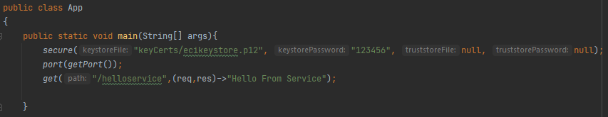
#### Realizamos la prueba y podemos verificar la informacion del certificado usado.
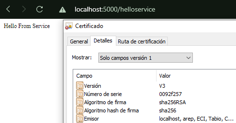

#### Creamos el Keystore

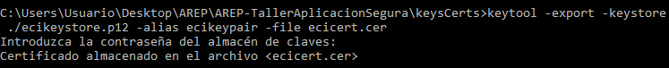
#### Añadimos el certificado al almacen de claves
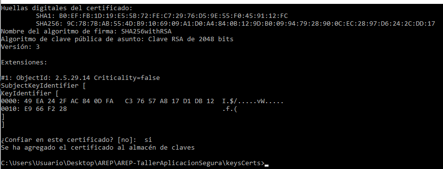
#### pasos
-Exporte el certificado a un archivo.
    
    keytool -export -keystore ./ecikeystore.p12 -alias ecikeypair -file ecicert.cer
  
-Importe el certificado a un TrustStore.

    keytool -import -file ./ecicert.cer -alias firstCA -keystore myTrustStore

#### Verificamos que se hallan creado los tres archivos en la carpeta especificada.
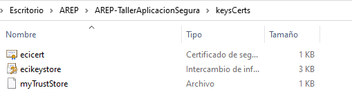

### Implementamos un secureURLReader.
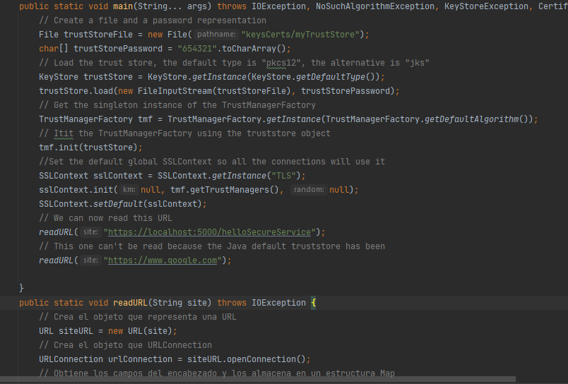
#### Probamos el funcionamiento de lo anteriormente implementado.
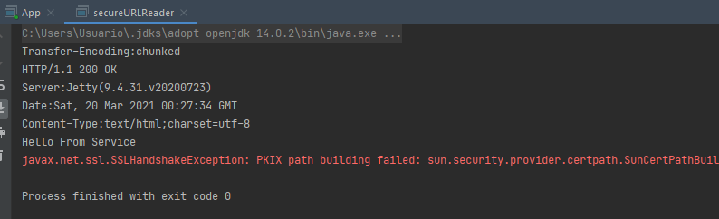
Se evidencia que el seguro lanzado por nosotros si es posible consultarlo ya que anteriormente modificamos el certificado para realizar esta lectura y por eso la lectura de google ya no es posible.

## Link video
[Video](https://drive.google.com/file/d/1DeuiGT-D4DEvPuEpN2jyFgTNSvxLgh0K/view?usp=sharing)
# Autor
Verbo Julian Camacho Villamarin

# Licencia

Este proyecto está licenciado bajo la licencia General Public License v3.0, revise el archivo [LICENSE](LICENSE.txt) para más información.

 
